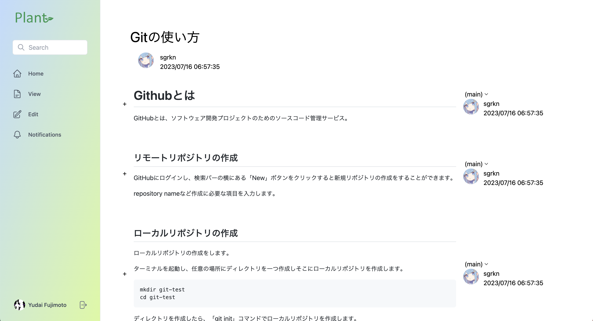

# Plant -記事を育てるプラットフォーム-

## Feature
- マークダウンで記事をかける
- 誰でも自分の環境やバージョンに合った記事を追記できる

## 仕様技術


## デプロイリンク
ブロントエンドのデプロイはAWS Amplifyで行っている。
|用途|対応するブランチ|URL|
| --- |--- | --- |
|本番環境|`main`|後で書きます|
|開発環境|`develop`|後で書きます|

## Gitブランチ名の命名規則

### 中央リポジトリ
* `main` 現在の製品バージョン。
* `develop` 次回リリースの開発用。

### 開発者リポジトリ
* `feat/#issueID-description`　新規機能の開発用。developから分岐し、developへマージする。
* `release/#issueID-description`　次回リリースの準備用。developから分岐し、developとmainへマージする。
* `hotfix/#issueID-description`　現在の製品バージョンのバグフィックス用。mainから分岐し、developとmainへマージする。

e.g. `feat-#1-Initialization`

## commit messagaeの命名規則
```
Prefix: 変更内容
e.g. feat: add search bar on toppage
```

Prefix例
- feat: 新しい機能
- fix: バグの修正
- docs: ドキュメントのみの変更
- style: 空白、フォーマット、セミコロン追加など
- refactor: 仕様に影響がないコード改善(リファクタ)
- perf: パフォーマンス向上関連
- test: テスト関連
- chore: ビルド、補助ツール、ライブラリ関連

## フロントエンド

### ローカル環境でのデバッグ
```
yarn install
yarn run dev
```
